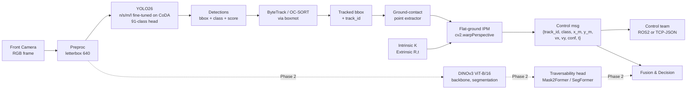

# 🤖 TerraVision

**Foundation Model 기반 모빌리티 로봇 인지 시스템**

다양한 주행 환경(캠퍼스, 도심, 험지, 농경지)에서 자율주행 로봇이 주변 환경을 이해하고 주행 가능 경로를 판단하기 위한 카메라 기반 인지 모델입니다. DINOv3 등 비전 파운데이션 모델을 활용하여 범용적이고 강건한 인지 성능을 목표로 합니다.

---

## 프로젝트 목적

모빌리티 로봇의 자율주행에 필요한 **시각 인지 파이프라인**을 구축합니다.

- **Object Detection + Tracking** — 주행 경로 상의 객체를 탐지·분류하고 연속 프레임에서 ID 를 유지
- **BEV Projection** — 객체의 지상 좌표 `(x_m, y_m, vx, vy)` 를 추정해 제어부로 전달
- **Traversability Segmentation** (a.k.a. *Freespace / Drivable Area*) — 주행 가능 영역을 픽셀 단위로 판별
- **멀티 환경 대응** — 단일 모델로 캠퍼스, 도심, 험지, 농경지 등 다양한 환경에서 동작

---

## 대상 주행 환경 및 인지 객체

### 공통 (전 환경)
사람(보행자), 차량/로봇, 자전거/킥보드, 동물, 낙하물/장애물

### 캠퍼스
벤치, 볼라드, 자전거 거치대, 계단/경사로, 건물 출입문, 표지판, 화단/조경물

### 도심
승용차/버스/트럭, 신호등, 횡단보도, 가드레일, 전봇대, 공사 구조물(바리케이드/콘)

### 험지
바위, 웅덩이, 경사면, 쓰러진 나무/나뭇가지, 도랑/수로, 불규칙 지면(자갈/진흙)

### 농경지
밭고랑, 비닐하우스, 관개 시설, 농기계, 작물 열(row), 울타리/경계선

---

## 시스템 아키텍처

Phase 1 은 **전면 단일 카메라 → Detection → Tracking → BEV 좌표** 의 단일 경로를 먼저 구축하고, Phase 2 에서 Traversability head 를, Phase 3 에서 멀티 카메라 Fisheye 파이프라인을 확장합니다.



세부 단계별 계획과 진행 상황은 [`docs/PLAN.md`](docs/PLAN.md) 와 [`docs/progress/`](docs/progress/) 에서 관리합니다.

---

## 카메라 구성

| 카메라 | 용도 | 비고 |
|--------|------|------|
| 전면 카메라 | 전방 정밀 인지 (원거리 객체 탐지) | 일반 렌즈 |
| Fisheye × 4 | 360° 서라운드 뷰 구성 | 전좌/전우/후좌/후우 |

- Fisheye 왜곡 보정 후 합성 또는 BEV(Bird's Eye View) 변환
- 전면 카메라는 원거리 정밀 탐지에 활용

---

## 기술 스택 (계획)

| 구분 | 기술 |
|------|------|
| Detection (Phase 1-3 부터) | **Ultralytics YOLO26** (n/s/m/l/x) · 91-class 통합 head (COCO80+CoDA 11) · AGPL-3.0 |
| Backbone (Phase 2 segmentation) | DINOv3 ViT-B/16 (gated, HF Transformers) · 폴백: DINOv2 ViT-B/14 (Apache-2.0) |
| Detection (Phase 1-2b, 보존) | DINOv3 ViT-B/16 + HF Deformable DETR — 체크포인트 보존, 신규 학습 없음 |
| Tracking | `boxmot` — ByteTrack / OC-SORT |
| BEV Projection | OpenCV `calibrateCamera` + `warpPerspective` (flat-ground IPM) |
| Traversability | Mask2Former / SegFormer 기반 (Phase 2) |
| Framework | PyTorch |
| 추론 최적화 | TensorRT / ONNX Runtime (Phase 3) |
| 데이터 관리 | CVAT, COCO JSON · YOLO txt 변환 (`training/datasets/coda_to_yolo.py`) |
| 실험 관리 | Weights & Biases |
| 설정 관리 | Hydra + OmegaConf |

---

## 프로젝트 구조 (예정)

```
terravision/
├── configs/                # 학습/추론 설정 파일
├── data/
│   ├── raw/               # 원본 데이터
│   ├── processed/         # 전처리된 데이터
│   └── annotations/       # 라벨 데이터
├── models/
│   ├── backbone/          # 파운데이션 모델 (DINOv3 래퍼)
│   ├── detection/         # Object Detection Head (DETR)
│   └── traversability/    # Traversability (Freespace / Drivable Area) Head
├── preprocessing/
│   ├── undistort/         # Fisheye 왜곡 보정
│   ├── stitching/         # 멀티 카메라 합성
│   └── bev/               # Bird's Eye View 변환
├── training/              # 학습 스크립트
├── inference/             # 추론 파이프라인
├── evaluation/            # 평가 메트릭 및 스크립트
├── utils/                 # 유틸리티 함수
├── notebooks/             # 실험 노트북
├── docs/                  # 문서
└── tests/                 # 테스트 코드
```

---

## 로드맵

단계별 세부 체크리스트·검증 로그·사용자 검토 결과는 [`docs/progress/`](docs/progress/) 에서 관리합니다. 각 단계는 **독립 PR + 사용자 검토 + 승인 후 다음 단계** 게이팅으로 진행합니다.

### Phase 0 — 기반 인프라
- [ ] `pyproject.toml`, `.pre-commit-config.yaml`, `pytest.ini`, `.gitignore`
- [ ] Hydra 골격 (`configs/base.yaml`)
- [ ] `docs/PLAN.md` / `docs/progress/` / `docs/decisions/` 문서 체계 구축
- [ ] 디렉토리 네이밍 정리 (`segmentation/` → `traversability/`)

### Phase 1 — Object Perception 파이프라인 (전면 단일 카메라)
- [x] 1-1 데이터 로더 — COCO JSON 통일, BDD100K → COCO 변환
- [x] 1-1b CODa primary 어댑터 (3D→2D 투영)
- [x] 1-2a DINOv3 백본 래퍼
- [x] 1-2b DETR head 학습 — 베이스라인 mAP=0.623 / AP50=0.925 (보존, 재학습 없음)
- [⛔] 1-2c 캠퍼스 데이터 파인튠 (DETR) — Closed, Phase 1-3 으로 대체
- [ ] **1-3 YOLO26 fine-tune baseline** — n→s→m→l 4단계, 91-class 통합 head, 목표 mAP≥0.65 / AP_small≥0.52
- [ ] 1-4 Tracking — `boxmot` ByteTrack 연결, MOTA/IDF1 평가
- [ ] 1-5 BEV Projection — 캘리브레이션 + flat-ground IPM + 제어부 인터페이스
- [ ] 1-6 통합·최적화 — `inference/pipeline.py`, 목표 ≥15 FPS @ 1280×720

### Phase 2 — Traversability Segmentation
- [ ] DINOv3 백본 공유 + Mask2Former/SegFormer head
- [ ] RUGD / Rellis-3D / Cityscapes / 자체 농경지 데이터 통합
- [ ] Detection 과의 멀티태스크 vs 분리 모델 실험

### Phase 3 — 멀티 카메라 · 온보드 배포
- [ ] Fisheye 4대 캘리브레이션 (OCamCalib / Kalibr) 및 BEV 융합
- [ ] TensorRT INT8 경량화
- [ ] Jetson Orin 급 온보드 실환경 주행 테스트

---

## Contributing

프로젝트 기여 방법은 추후 업데이트 예정입니다.

---

## License

본 저장소의 **자체 구현 코드는 MIT License** (ⓒ 2026 Software and System Laboratory, Daegu Catholic University) 를 따릅니다. 전체 조항은 [`LICENSE`](LICENSE) 참고.

외부 의존성 · 모델 가중치는 각자의 라이선스를 따릅니다. 두 가지 핵심 주의사항:

- **Ultralytics (YOLO26, Phase 1-3 부터 detection 라인)** — **AGPL-3.0**. 본 저장소가 ultralytics 를 import 하므로 파생 저작물의 소스 공개 의무가 따라붙습니다. 학술/연구 범위는 무관하나 **상용 배포 시 ultralytics 상용 라이선스 또는 RT-DETR (Apache-2.0) 같은 대체 head 가 필요**합니다 — 상세는 `docs/decisions/20260428_pivot-to-yolo26.md` 의 R1 (AGPL-3.0 라이선스) 섹션 참고.
- **DINOv3 사전학습 가중치 (Phase 2 segmentation 백본 후보)** — Apache-2.0 이 아닌 **자체 DINOv3 License** (Hugging Face gated access). 다운로드 전 HF 계정에서 라이선스 동의가 필요하며 상용 배포 조건은 별도 검토 — `docs/decisions/20260422_dinov3-backbone.md` 참고.

---

## 📚 참고 자료

- [Ultralytics YOLO26](https://docs.ultralytics.com/models/yolo26/) — Phase 1-3 detection
- [DINOv3 (Meta AI)](https://github.com/facebookresearch/dinov3) — Phase 2 segmentation 백본 후보
- [DINOv2 (Meta AI)](https://github.com/facebookresearch/dinov2) — DINOv3 폴백
- [boxmot (tracking)](https://github.com/mikel-brostrom/boxmot)
- [Mask2Former](https://github.com/facebookresearch/Mask2Former)
- [nuScenes Dataset](https://www.nuscenes.org/)
- [BDD100K Dataset](https://bdd-data.berkeley.edu/)
- [RUGD (Robot Unstructured Ground Driving)](http://rugd.vision/)
- [Rellis-3D Dataset](https://github.com/unmannedlab/RELLIS-3D)
- [Cityscapes Dataset](https://www.cityscapes-dataset.com/)
