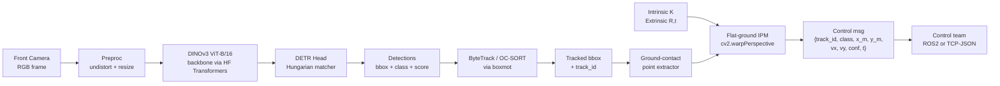

# TerraVision 개발 플랜 (in-repo 사본)

본 문서는 `/home/soobin/.claude/plans/here-is-the-approved-synthetic-iverson.md` 로 승인된 플랜의 저장소 내 사본이다. 의사결정 로그와 단계별 진행은 `docs/progress/` · `docs/decisions/` 에 분리해 기록한다.

> 현재 상태: **Phase 1-2a — DINOv3 백본 래퍼** 완료·검토대기 (2026-04-24). Phase 0 · 1-1 · 1-1b 승인완료. 데이터 전략: **CODa primary · BDD100K auxiliary** — 상세 ADR: `docs/decisions/20260422_coda-primary-dataset.md`. 세부 작업 로그는 `docs/progress/phase*.md` 에서 다룬다.

---

## 목표 요약

- **Phase 1**: Object Detection → Tracking → BEV projection (제어부 좌표 전달)
- **Phase 2**: Traversability (= Freespace / Drivable Area) 인지
- **Phase 3**: 멀티 카메라 · 온보드 TensorRT 배포

Detection 모델:

- 백본 = `facebook/dinov3-vitb16-pretrain-lvd1689m` (ViT-B/16, 86M)
- 로딩 = `transformers.AutoModel.from_pretrained(...)` (HF Transformers ≥ 4.56)
- Head = `mmdetection` 의 DINO-DETR 에 백본만 교체
- 라이선스 주의: DINOv3 는 gated. `HF_TOKEN` 필요, 상용 배포 조건 별도 검토 — 상세는 `docs/decisions/20260422_dinov3-backbone.md`

Tracking:

- `boxmot` (ByteTrack 우선, OC-SORT 옵션)

초기 배치:

- 환경 = **캠퍼스**, 카메라 = **전면 단일**

---

## 용어

- 프로젝트 공식 용어 = **Traversability Segmentation** (a.k.a. *Freespace / Drivable Area*)
- 저장소 디렉토리: `models/traversability/` (이전 `models/segmentation/` 은 Phase 0 에서 교체)

---

## 단계 게이팅

각 단계 PR 은 **사용자 검토 → 승인 → 다음 단계 진입** 순서를 따른다. 진행 상태는 `docs/progress/README.md` 대시보드에서 추적한다. 각 단계 파일의 "사용자 검토 결과" 섹션이 채워지기 전에는 다음 단계 파일을 생성하지 않는다.

| # | 단계 | 상태 | 진행 파일 |
|---|------|-----|---------|
| 0 | 기반 인프라 | 🟢 승인완료 | `docs/progress/phase0.md` |
| 1-1 | 데이터 로더 (BDD 변환 + COCO 스키마) | 🟢 승인완료 | `docs/progress/phase1-1_data_loader.md` |
| 1-1b | CODa 어댑터 (primary 데이터셋) | 🟢 승인완료 | `docs/progress/phase1-1b_coda_adapter.md` |
| 1-2a | DINOv3 백본 래퍼 | ✅ 완료·검토대기 | `docs/progress/phase1-2a_backbone.md` |
| 1-2b | DETR 헤드 학습 | 예정 | `docs/progress/phase1-2b_detection.md` |
| 1-2c | 캠퍼스 데이터 파인튠 | 예정 | `docs/progress/phase1-2c_finetune.md` |
| 1-3 | Tracking | 예정 | `docs/progress/phase1-3_tracking.md` |
| 1-4 | BEV projection | 예정 | `docs/progress/phase1-4_bev.md` |
| 1-5 | 통합 · 최적화 | 예정 | `docs/progress/phase1-5_integration.md` |
| 2 | Traversability | 예정 | `docs/progress/phase2_traversability.md` |
| 3 | 멀티캠 · 온보드 | 예정 | `docs/progress/phase3_multicam_onboard.md` |

---

## 데이터 흐름 (Phase 1)

Phase 2 는 `BB` 뒤에 별도 Mask2Former/SegFormer head 가 분기해 `seg_mask` 를 산출하는 형태로 접속된다.

---

## 열린 질문 (플랜 승인 시점)

1. 제어부 전달 채널: ROS 2 vs TCP/JSON — 기본값 TCP/JSON, 어댑터로 교체 가능.
2. 온보드 타겟 HW: Jetson Orin NX/AGX?
3. 자체 데이터 수집 일정 · 플랫폼.
4. 모델 체크포인트 라이선스 — DINOv3 gated / 상용 조건, 폴백 DINOv2 ViT-B/14 (Apache-2.0).
5. HF 토큰 관리 — 팀 공용 vs 개인, CI 다운로드 전략.

각 질문은 관련 phase 가 착수될 때 해당 `docs/progress/phase*.md` 에서 해소된다.
